```{r setup}
library(tidyverse)
library(imager)
```

# Contenuti

Fondamenti teorici per la **fotografia digitale**:

* La teoria del colore
* L'immagine fotografica digitale


# La teoria del colore
Cos'è il colore? come rappresentarlo?

## Perché parlare di teoria del colore?

- La postproduzione **non modifica la luce**, ma la sua *rappresentazione numerica*
- Le immagini digitali vivono in **spazi colore** ben definiti
- Molti problemi pratici (dominanti, colori spenti, clipping) hanno **cause percettive e matematiche**

:::callout-important
## Obiettivo 
Capire **cosa** stiamo modificando quando spostiamo uno slider
:::


## La luce

:::columns
:::column
La luce è una radiazione elettromagnetica, descritta da 

* intensità, o ampiezza, delle oscillazioni (*luminosità*)
* frequenza delle oscillazioni (*colore*)
* polarizzazione, o orientamento, delle oscillazioni (**non percepibile!**)
:::

:::column
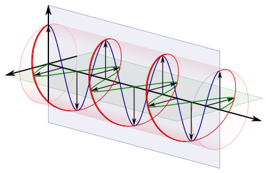
:::
:::


:::callout-important
Note queste tre componenti, un fascio luminoso è perfettamente descritto
:::


## Il colore: una costruzione percettiva

:::columns
:::column
L'occhio umano **non percepisce la polarizzazione**, ma percepisce colore e intensità

Il nostro sistema visivo elabora dei segnali fisici costruendo una **rappresentazione**

Questa rappresentazione è soggettiva e può essere ingannevole

Rappresentare un colore richiede la conoscenza dei meccanismi di percezione umana
:::

:::column

:::
:::

:::callout-note
Nel caso di [*The dress*](https://en.wikipedia.org/wiki/The_dress){height="500px"} alcuni percepiscono il vestito come blue e nero, altri come bianco e oro
:::


## Il colore: una costruzione percettiva

:::columns
:::column
In questa versione si comprende meglio la possibilità di interpretazione

* Il colore è una **percezione**, cioè una costruzione del nostro cervello
* La percezione è affetta dalla globalità dell'immagine, per cui il colore di un dettaglio è caratterizzato più dal suo contesto che dal dettaglio in sé
* Cos'è il **colore bianco**?
:::

:::column
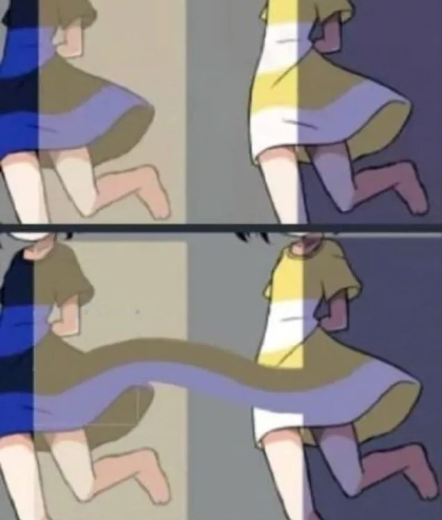{height="400px"}
:::
:::


## Il colore: una costruzione percettiva

:::columns
:::column
* La luce è raramente monocromatica
* Più spesso è una combinazione, uno **spettro continuo** di lunghezze d'onda
* L'occhio umano **non misura lo spettro**, ma lo *percepisce* mediante cellule sensibili
* La retina contiene:
  - bastoncelli, sensibili all'intensità in luce scarsa
  - **tre tipi di coni** sensibili all'intensità in luce intensa su tre diverse lunghezze d'onda (*S, M, L*)

:::callout-note
A livello **percettivo umano**, ogni colore è descritto da **tre valori**: due sono troppo pochi, tre sono troppi
:::

:::
:::column
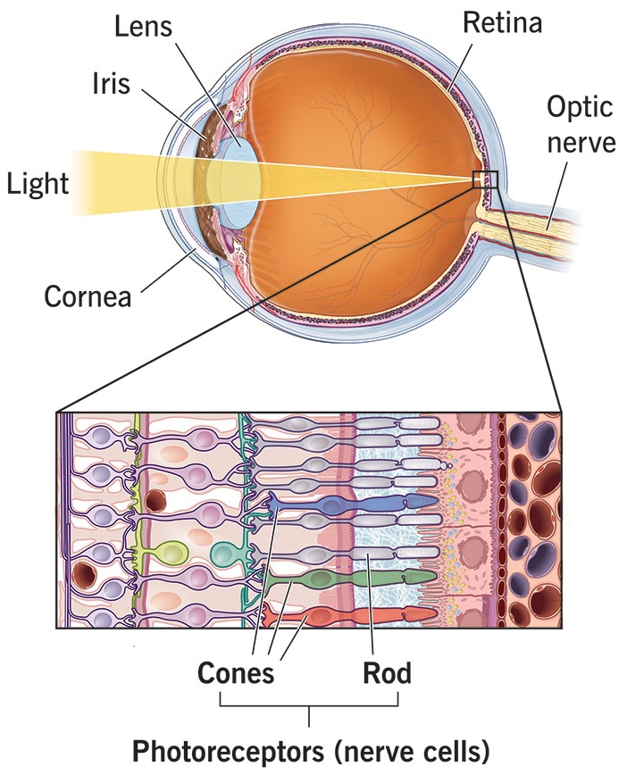{width=500px}
:::
:::

## Il colore: una costruzione percettiva

:::columns
:::column
* La maggior parte dei mammiferi ha solo i coni [M]{.bgreen} e [S]{.bblue}
* I primati hanno sviluppato i coni [L]{.bred} circa 40 mila anni fa
* L'assenza di coni [L]{.bred} è un carattere recessivo: cecità al colore

:::callout-note
Con l'età, modifiche nel cristallino (cateratta) aumentano la sensibilità all'infrarosso: questo spinge a cercare immagini **più sature**
:::
:::

:::column
{width=500px}
:::
:::


## Perché bastano tre componenti?

- Ogni cono fornisce un solo *messaggio* (quanta luce assorbe)
- Il cervello riceve quindi una *terna* di informazioni
- Spettri diversi possono produrre la **stessa percezione cromatica** (*metameri*)

Quindi mescolare **tre componenti primarie** (es. [R]{.bred}[G]{.bgreen}[B]{.bblue}) è sufficiente per rappresentare qualsiasi colore percepibile dall'occhio umano:

- Un’immagine RGB non descrive lo spettro
- Descrive *come l’immagine stimola l’occhio umano*

:::callout-note
### Più di tre coni?
Alcune specie animali hanno più di tre coni: la maggior parte degli uccelli ha anche un tipo di cono per UV; i pesci fino a 7, i crostacei fino a 16
:::


## Il colore come sottrazione di componenti

:::columns
:::column
* Nella pittura (e nella stampa) i pigmenti **assorbono** componenti dello spettro: 
  - **nessun pigmento = nero**
  - **tutti i pigmenti = bianco**
* Si usano tre primari (rosso-giallo-blu RBY, oppure ciano-magenta-giallo CYMK)
* I colori secondari sono quelli opposti ai primari
* I colori terziari sono i restanti
* I colori **complementari** sono quelli opposti
:::

:::column
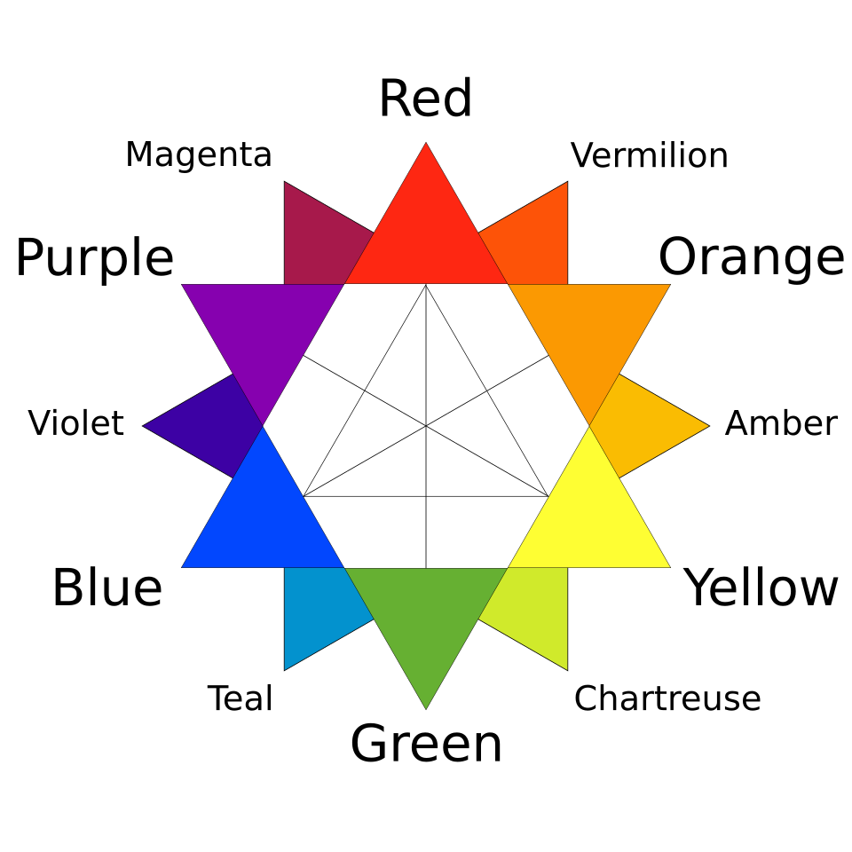{height="500px"}
:::
:::

## Il colore come somma di componenti

:::columns
:::column
* Nei supporti digitali (display) i pixel **emettono** componenti dello spettro: 
  - **nessun pigmento = nero**
  - **tutti i pigmenti = bianco**
* Si usano tre primari (rosso-verde-blu, RGB)
* I colori secondari sono quelli opposti ai primari
* I colori terziari sono i restanti
* I colori **complementari** sono quelli opposti
:::

:::column
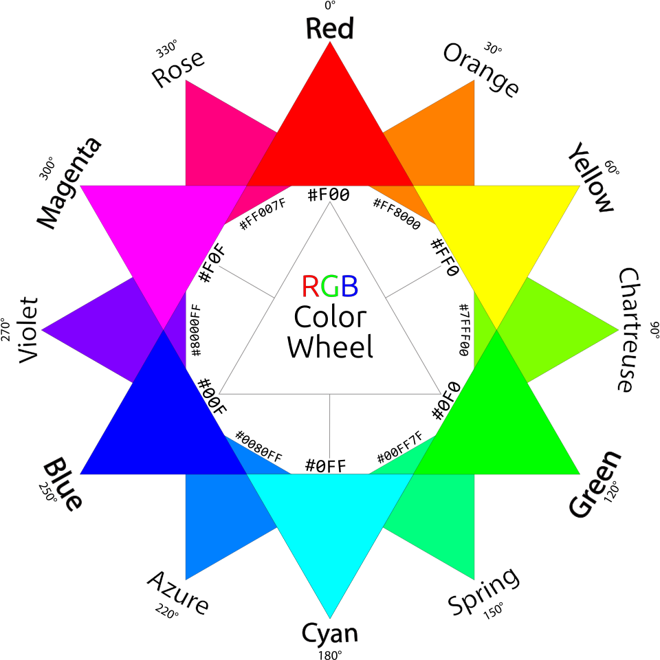{height="500px"}
:::
:::


## Gli spazi-colore

OK, servono e bastano tre componenti. Ma come **misuriamo** e **rappresentiamo** le relative intensità?

* Serve un accordo su che valori numerici dare alle componenti del colore (matematica 😱)
* La scelta è puramente arbitraria: per semplicità, si assume che ogni componente possa assumere valori da 0 a 1
* Nel 1931 la *Commission Internationale de l'Eclairage* (CIE) definì uno spazio 3-D di colore che comprendeva tutte le tinte visibili dall'occhio umano, con coordinate $X, Y, Z$
* Nel cubo di lato 1 in questo spazio ci sono tutte le tinte visibili, dal nero assoluto $<0,0,0>$ al bianco assoluto $<1,1,1>$
* Ma uno spazio 3-D è scomodo da visualizzare: come possiamo semplificare?
* Si **normalizza la luminanza** (cioè la componente di luminosità)


## Lo spazio-colore CIE

:::columns
:::column
Lo spazio colore CIE rappresenta cioè le intensità di tre componenti *estreme* corrispondenti a:

* $X$: [rosso-viola]{.bred} ipersaturo, con due lunghezze d'onda a 450 nm e 600 nm
* $Y$: [verde]{.bgreen} ipersaturo, a 520 nm
* $Z$: [blu]{.bblue} ipersaturo, a 477 nm

Per rappresentarli su un **piano 2-D** si può usare la sezione del cubo con **intensità complessiva uniforme e uguale a 1**
:::

:::column
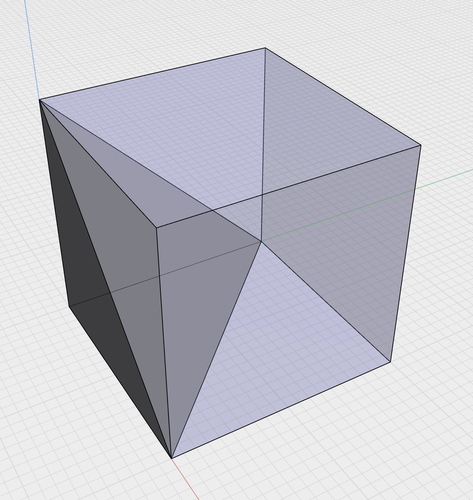{height="500px"}
:::
:::


## Gli spazi colore come sottoinsieme del CIE

:::columns
:::column
:::callout-important
Non tutto lo spazio CIE è comunque percepibile: sul contorno della sezione si riportano i limiti percettivi con le rispettive lunghezze d'onda
:::

* Diversi dispositivi digitali (sia di cattura che di riproduzione) generalmente **non coprono l'intero spettro visibile**, ma solo un sottoinsieme
* Esistono **spazi-colore** standard adatti a diversi dispositivi
* Ad es. lo spazio **sRGB** è stato il riferimento per i display fino all'avvento di display ad alta dinamica nel decennio attuale
:::

:::column
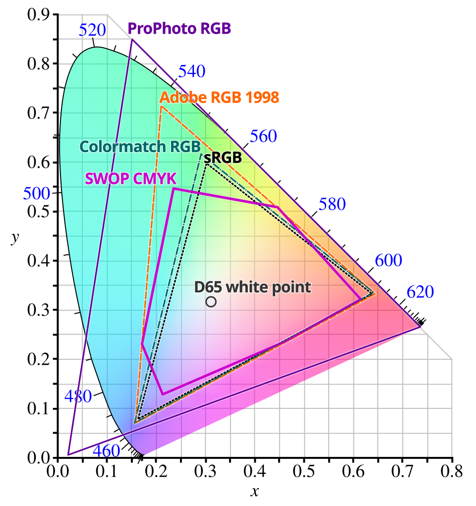{height="500px"}
:::
:::

## Gli spazi colore come sottoinsieme del CIE

:::columns
:::{.column .smaller}

* Il punto marcato *D65* è detto **illuminante CIE** e corrisponde al bianco percepito dalla radiazione riflessa da una superficie bianca illuminata da luce diurna media
* Il contorno a campana riporta i **colori spettrali** (dall'indaco al rosso)
* Il segmento in basso riporta i **colori non-spettrali** (*porpore*)
* Tutti i colori sul piano CIE hanno la stessa **luminanza**, mentre la saturazione cresce da D65 verso il bordo
* Quindi posso rappresentare lo stesso spazio colore anche come *hue*, *saturation*, *luminance* (**HSL**), cioè *tinta*, *saturazione* e *luminanza*

:::callout-warning
Convertire tra spazi colore può comportare modifica percettiva sostanziale di una immagine!
:::

:::

:::column
{height="500px"}
:::
:::


## L'effetto degli spazi colore

* Lo spazio colore adottato è **scritto nei metadati di una immagine**
* Il sistema di visualizzazione (display o stampa) può gestire lo spazio colore (*color-management*) oppure no
* *Color management* significa che il dispositivo **trasforma** i colori estendendoli o comprimendoli allo spazio-colore di destinazione (**gamut**)
* A seconda del profilo colore adottato da sorgente e destinazione e del fatto che il dispositivo di uscita supporti il *color management* possono aversi diverse situazioni


## Senza *color-management*

Questo avviene soprattutto su dispositivi e software che gestiscono solo sRGB, come browser antiquati o semplificati per dispositivi minimali

:::columns
:::{.column}
### Adobe RGB  sRGB

* Si ha una compressione dello spazio colore
* L'immagine risulta piatta
* In particolare, i verdi e (un po' meno) i rossi sono spenti
* Si guadagna una dominante magenta
:::

:::{.column}
### sRGB  Adobe RGB (o P3)

* Si ottiene una immagine con colori generalmente troppo saturi
* Si nota soprattutto nei verdi, che diventano [radioattivi]{.bgreen}
* Si guadagna una dominante verde
* Le variazioni di colore sono meno dolci
:::
:::


## Con *color-management*

Il software/dispositivo legge il profilo colore nell'immagine e riproietta i colori nello spazio più piccolo (gamut ridotto)

:::columns
:::column
### Adobe RGB  sRGB

* I colori sono corretti
* Si perde però in vivacità percettiva (perché il dispositivo non è in gradi di visualizzare i colori più saturi)
* La differenza si percepisce maggiormente nei verdi
:::

:::column
### sRGB  Adobe RGB (o P3)

* I colori sono percettivamente identici a quelli visualizzati su un display Adobe RGB
* Tutavia non si sfrutta la capacità di stimolo visivo del display

:::
:::


## In conclusione

* Oggi la maggior parte dei dispositivi è in grado di gestire il colore
* Conviene **impostare la camera** in modo da creare file in formato Adobe RGB
* In questo modo si possono sfruttare al meglio dispositivi e software moderni
* In Lightroom, in modalità Sviluppo abilitare *Prova Colore* e poi scegliere il profilo/spazio di destinazione (in alto a destra, sotto l'istogramma)
* La simulazione funziona bene se si usa un display con gamut ampio (P3 o Adobe RGB) e si vuole verificare un gamut più ridotto (ad esempio per la stampa)


## Impostare il profilo colore in camera

La maggior parte delle camere consente di scegliere lo spazio colore (sRGB o Adobe RGB):

* Se si scatta in JPG, la scelta cambia la qualità dell'immagine a seconda del dispositivo di destinazione (vedi sopra)
* Se si scatta in RAW, il *contenuto* dell'immagine non cambia, tuttavia:
  - il profilo viene salvato nei metadati e usato dal software di sviluppo
  - il profilo viene utilizzato per la generazione dell'anteprima JPG
  - il profilo viene utilizzato per la **visualizzazione dell'istogramma**
* Quindi, scegliere Adobe RGB in generale dà meno *clipping* delle saturazioni, ed è più utile per anticipare cosa è possibile ottenere dal RAW


# L'immagine digitale
Come si costruisce un'immagine fotografica digitale?


## Com'è fatto un sensore (CMOS)

:::columns
:::column
Fotositi
:::

:::column
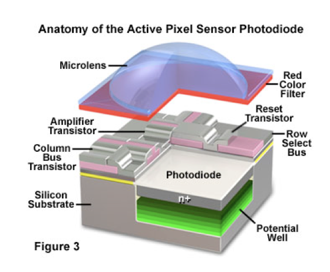{width=400px fig-align="center"}
:::
:::

## Com'è fatto un sensore (CMOS)

:::columns
:::column
Color Filter Array
:::

:::column
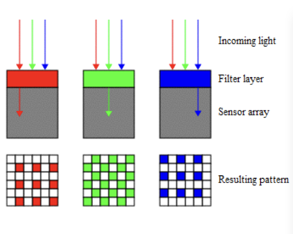{width=400px fig-align="center"}
:::
:::


## *Color Filter Array* (CFA)

:::columns
:::column
Bayer o X-Trans
:::

:::column
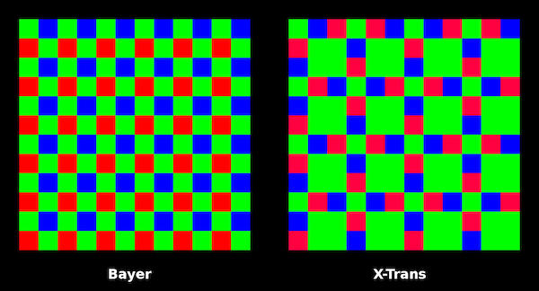
:::
:::


## Interpolazione, o "sviluppo RAW"

:::columns
:::column
left
:::

:::column
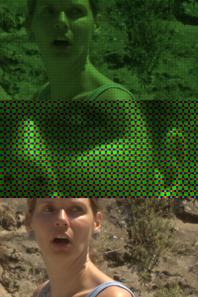{width=400px fig-align="center"}
:::
:::


## Profindità di colore (bit)


## Gamma dinamica


## ISO e sensibilità


## Formati RAW


## Formati di output: JPG


## Formati di output: PNG


## Formati di output: TIFF


## Bilanciamento del bianco: idea chiave

::: columns 
::: {.column width="50%"}

- Il cervello umano compensa automaticamente la temperatura della luce
- Il sensore **non lo fa**
- Il bilanciamento del bianco è una **correzione moltiplicativa dei canali**

➡️ Serve a ristabilire una risposta *neutra* ai grigi

::: 
::: {.column width="50%"}

```{r}

# img <- load.image("example.jpg")
img <- boats

df <- as.data.frame(img, wide = "c") |>
  rename(R = c.1, G = c.2, B = c.3)

df_long <- tidyr::pivot_longer(df, c(R, G, B), names_to = "channel", values_to = "value")

ggplot(df_long, aes(value)) +
  geom_histogram(bins = 100) +
  facet_wrap(~channel, ncol = 1) +
  labs(title = "Istogrammi RGB prima del WB")
```

::: 
:::


---

## Bilanciamento del bianco: punto critico

- Il WB **non è una correzione estetica**, ma percettiva
- Va fatto **prima** di contrasto e saturazione
- Un WB errato distorce:
  - istogrammi RGB
  - separazione cromatica
  - conversioni di spazio colore

---

## Profili ICC: perché sono necessari

::: columns 
::: {.column width="50%"}

- I numeri RGB **non hanno significato assoluto**
- Un profilo ICC dice:
  - che colore *reale* corrisponde a quei numeri
  - come convertire correttamente tra dispositivi

📌 Senza profilo ICC → i colori sono ambigui

```{r}
# confronto valori medi RGB
mean_rgb <- df_long |>
  dplyr::group_by(channel) |>
  dplyr::summarise(mean_value = mean(value))

mean_rgb
```

➡️ Stessi numeri RGB, profili diversi → **colori diversi**

::: 
::: {.column width="50%"}

{width=100%}

*Pipeline colore semplificata con profili ICC*

::: 
:::

- I numeri RGB **non hanno significato assoluto**
- Un profilo ICC dice:
  - che colore *reale* corrisponde a quei numeri
  - come convertire correttamente tra dispositivi

📌 Senza profilo ICC → i colori sono ambigui

---

## Catena del colore (semplificata)

1. Sensore (risposta spettrale propria)
2. Profilo camera
3. Spazio di lavoro (es. ProPhoto)
4. Editing
5. Conversione verso output (monitor / stampa)

➡️ Ogni passaggio è una **trasformazione di coordinate**

---

## Cos’è il gamut

- Il gamut è l’insieme dei colori **rappresentabili**
- Dipende dal dispositivo o dallo spazio colore
- Non tutti i colori percepibili sono rappresentabili

Esempio:

- sRGB ⊂ AdobeRGB ⊂ ProPhotoRGB

---

## Gamut e postproduzione

::: columns 
::: {.column width="50%"}

- Aumentare saturazione ≠ aumentare gamut
- I colori fuori gamut vengono:
  - compressi
  - tagliati (clipping)

```{r}
# saturazione artificiale
# img_sat <- imappend(list(img, imager::imstretch(img, c(0, 1))), "x")
# plot(img_sat)
```

📌 Problema tipico: colori vividi a monitor → spenti in stampa

::: 
::: {.column width="50%"}

{width=100%}

*Confronto concettuale tra gamut (sRGB vs AdobeRGB)*

::: 
:::

- Aumentare saturazione ≠ aumentare gamut
- I colori fuori gamut vengono:
  - compressi
  - tagliati (clipping)
  - deformati

📌 Problema tipico: colori vividi a monitor → spenti in stampa

---

## Visualizzare il gamut (idea)

::: columns 
::: {.column width="50%"}

- Lightroom lavora sempre in uno **spazio interno molto ampio** (simile a ProPhoto)
- Il problema del gamut emerge:
  - in **soft proofing**
  - in **export**
- Il diagramma CIE xy serve a *capire*, non a lavorare

```{r}
library(ggplot2)

# dati semplificati per illustrare il concetto di gamut
cie <- data.frame(
  x = c(0.64, 0.30, 0.15, 0.64),
  y = c(0.33, 0.60, 0.06, 0.33),
  space = "sRGB"
)

ggplot(cie, aes(x, y)) +
  geom_polygon(fill = NA) +
  coord_equal() +
  labs(title = "Gamut sRGB (rappresentazione concettuale)")
```

::: 
::: {.column width="50%"}

> In Lightroom non *vediamo* il gamut, ma ne subiamo gli effetti in output

- Avvisi di gamut in soft proof
- Colori saturi che collassano
- Perdita di separazione cromatica

::: 
:::

- Il diagramma CIE xy mostra:
  - colori percepibili
  - contorni dei gamut
- Utile concettualmente, **non operativo**

> In pratica lavoriamo sempre in RGB

---

## Lightroom: perché uno spazio interno ampio

::: columns 
::: {.column width="50%"}

- Lightroom usa un **RGB molto esteso** (simile a ProPhoto)
- Serve a:
  - evitare clipping durante editing
  - preservare saturazioni elevate
- L’utente **non sceglie** questo spazio

📌 Il problema nasce **solo in export**

```{r}
# confronto saturazione su pixel
set.seed(1)
rgb <- data.frame(
  R = runif(1000, 0.2, 0.9),
  G = runif(1000, 0.2, 0.9),
  B = runif(1000, 0.2, 0.9)
)

rgb$sat <- pmax(rgb$R, rgb$G, rgb$B) - pmin(rgb$R, rgb$G, rgb$B)

ggplot(rgb, aes(sat)) +
  geom_histogram(bins = 50) +
  labs(title = "Distribuzione della saturazione (spazio ampio)")
```

::: 
::: {.column width="50%"}

- In Develop: tutto sembra "ok"
- In Export sRGB:
  - compressione
  - clipping

> Lightroom protegge l’editing, non l’output finale

::: 
:::

- Gamut molto ampio
- Riduce il rischio di clipping in editing
- **Richiede profondità elevata** (16 bit)

⚠️ Con 8 bit → posterizzazione

---

## Messaggi chiave da portare a casa

- Il colore è una *costruzione percettiva*
- RGB funziona perché l’occhio è tricromatico
- WB e profili ICC sono **fondamentali**, non opzionali
- Il gamut è un vincolo fisico, non un’opinione

---

## Esercitazione guidata (Lightroom-centric)

::: columns 
::: {.column width="50%"}

**Stesso file RAW**

1. WB automatico
2. WB manuale (pipetta su grigio)
3. Saturazione + Vibrance

```{r}
# analisi istogrammi RGB su crop
crop <- crop.borders(img, 100, 100, 100, 100)

df_crop <- as.data.frame(crop, wide = "c") |>
  rename(R = c.1, G = c.2, B = c.3) |>
  tidyr::pivot_longer(c(R, G, B), names_to = "channel", values_to = "value")

ggplot(df_crop, aes(value)) +
  geom_histogram(bins = 80) +
  facet_wrap(~channel, ncol = 1)
```

**Domanda chiave**:

> cosa è cambiato nei numeri, non nell’immagine?

::: 
::: {.column width="50%"}

- WB → riallinea i canali
- Saturazione → aumenta separazione
- Export → applica i vincoli del gamut

📌 Lightroom è *non distruttivo*, ma **non è neutro**

::: 
:::

- Stessa immagine RAW
- WB diverso
- Spazio colore diverso
- Analisi istogrammi RGB

➡️ Osservare cosa cambia *numericamente*, non solo visivamente

